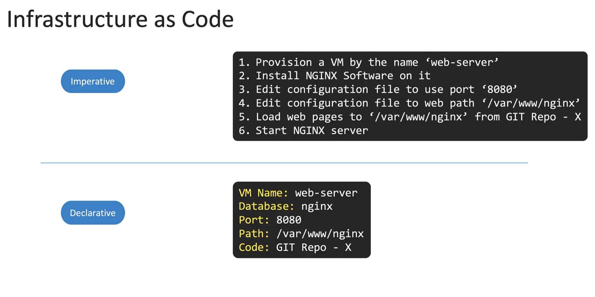
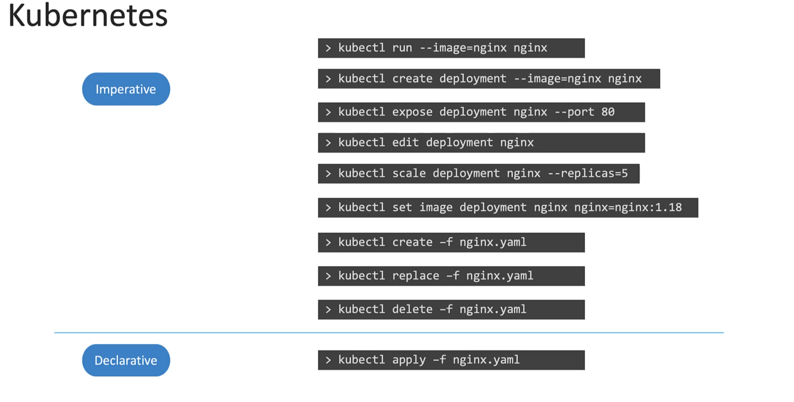
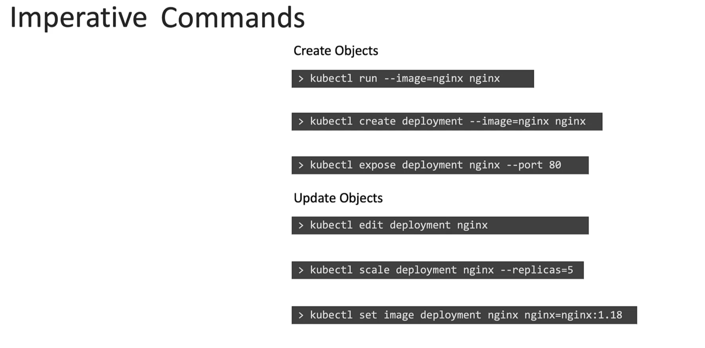
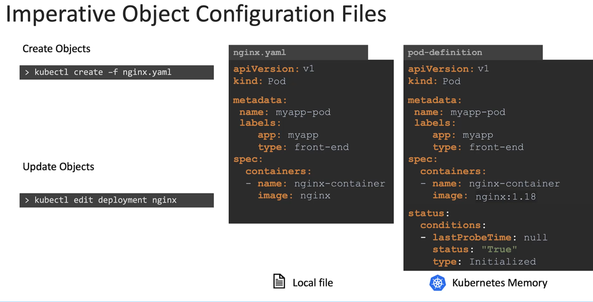
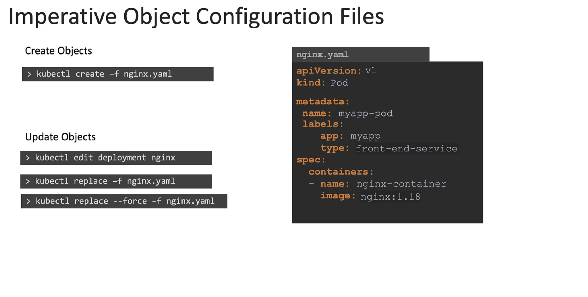
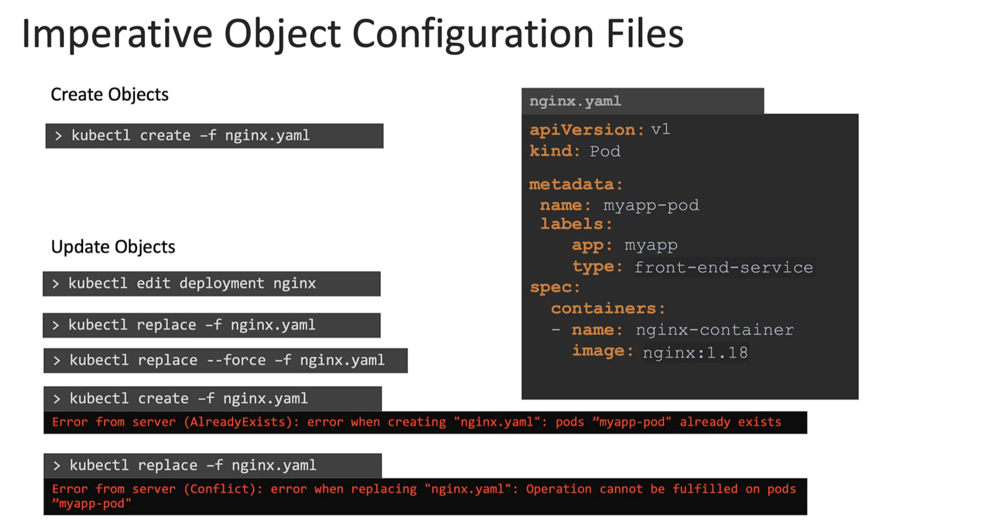
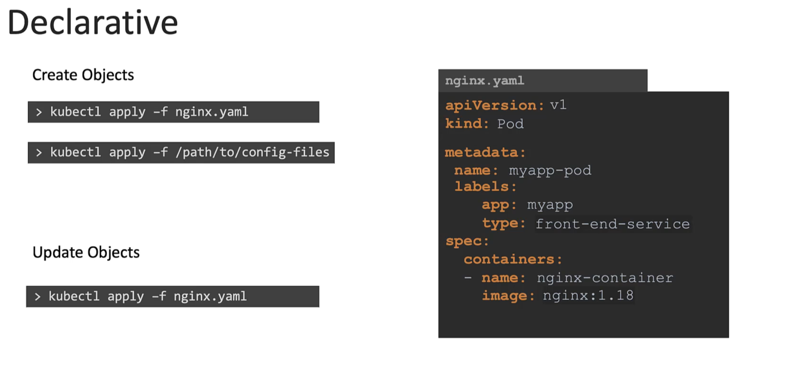
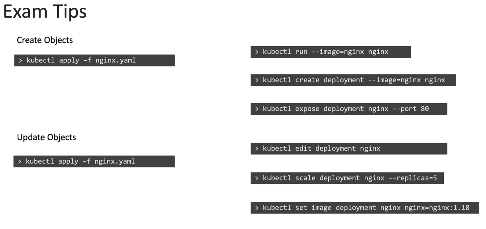

# Certification Tips - Imperative Commands with kubectl
  - Take me to the [Tutorial](https://kodekloud.com/courses/539883/lectures/10503265)

  -
    

  -
    

  -
    

  -
    

  -
    

  -
    

  -
    
    
 -
    


#  Helpfull Commands
https://kubernetes.io/docs/reference/kubectl/conventions/

- POD
	```
  	Create an NGINX Pod

  		kubectl run nginx --image=nginx

  		kubectl run --generator=run-pod/v1 sw --image=nginx

		kubectl run --generator=run-pod/v1 ws --image=nginx --dry-run=client -o yaml > pod.yaml
	```

- Deployment
	```
	kubectl create deployment --image=nginx ws

	kubectl create deployment --image=nginx nginx --dry-run=client -o yaml

	kubectl create deployment --image=nginx nginx --dry-run=client -o yaml > deployment.yaml


	*** kubectl create deployment does not have a --replicas option.
	    You could first create it and then scale it using the kubectl scale command. 

	```

- Service
	```
	kubectl expose pod ws --port=6379 --name redis-service

	** This will automatically use the pod's labels as selectors


	kubectl expose pod ws --port=6379 --name redis-service --dry-run=client -o yaml > service.yaml


	kubectl create service clusterip redis --tcp=6379:6379 --dry-run=client -o yaml  

	 *** This will not use the pods labels as selectors, instead it will assume selectors as app=redis.
	     You cannot pass in selectors as an option. 
	     So it does not work very well if your pod has a different label set. 
	     So generate the file and modify the selectors before creating the service)


	kubectl expose pod nginx --name ws-service --type=NodePort --target-port=80 --port=5000 --dry-run=client -o yaml > service.yaml

	*** This will automatically use the pod's labels as selectors, but you cannot specify the node port.
	    You have to generate a definition file and then add the node port in manually before creating the service with the pod.


	kubectl create service nodeport nginx --tcp=80:80 --node-port=30080 --dry-run=client -o yaml > service.yaml
	*** This will not use the pods labels as selectors

	
	- Both the above commands have their own challenges.
	  While one of it cannot accept a selector the other cannot accept a node port. 
	  I would recommend going with the `kubectl expose` command. 
	  If you need to specify a node port, generate a definition file using the same command and manually input the nodeport before creating the service.

	```
