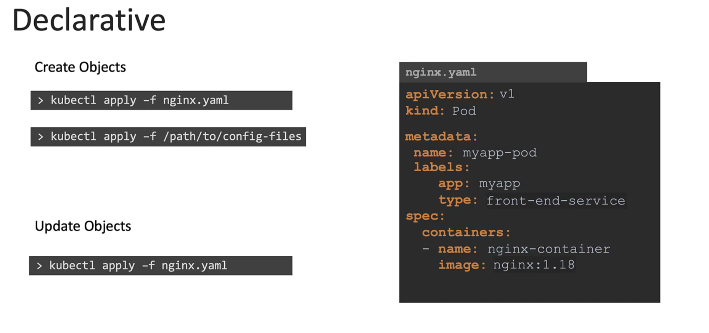
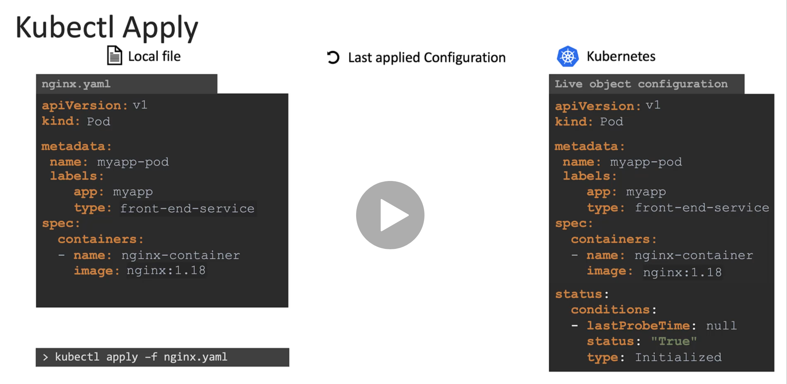
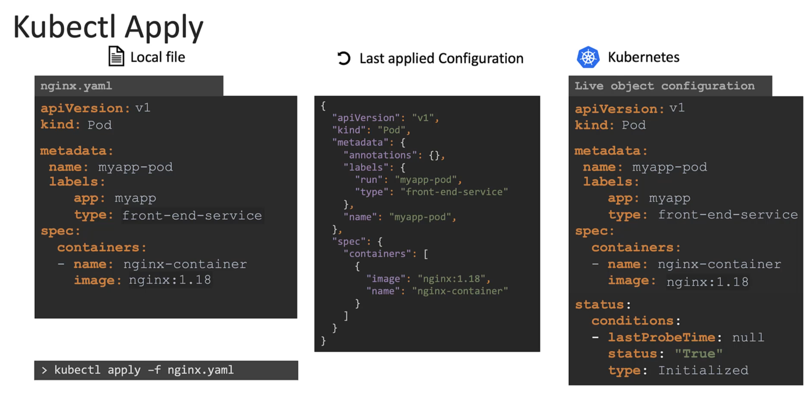
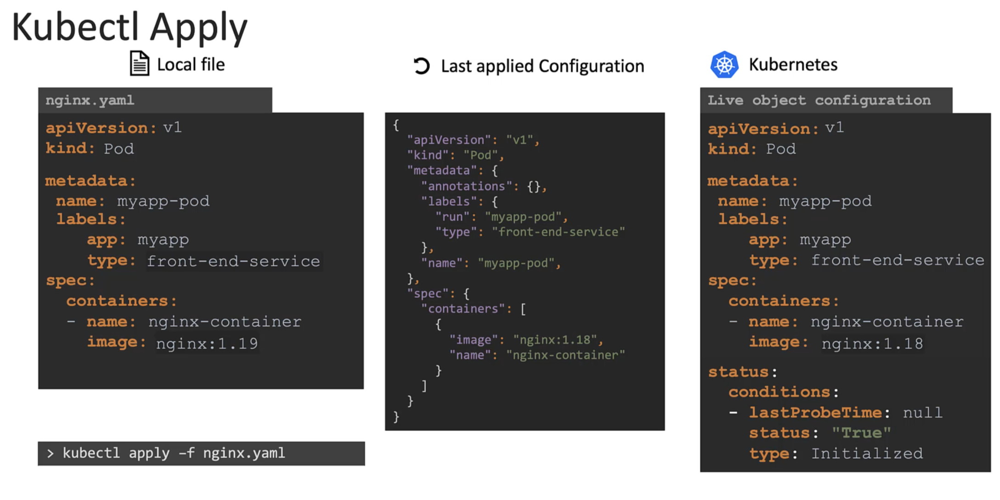
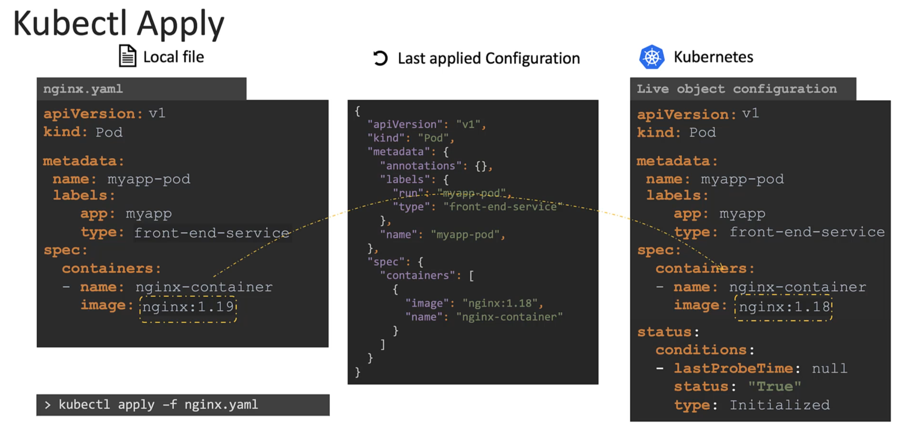
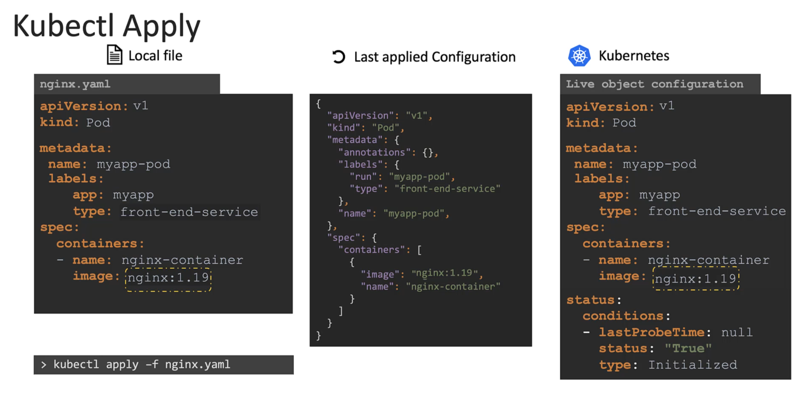
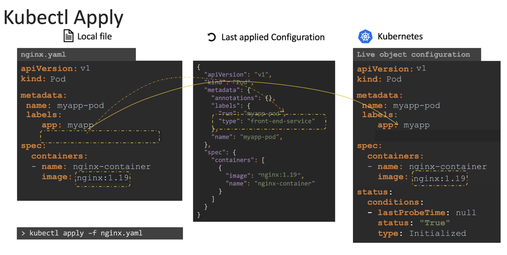
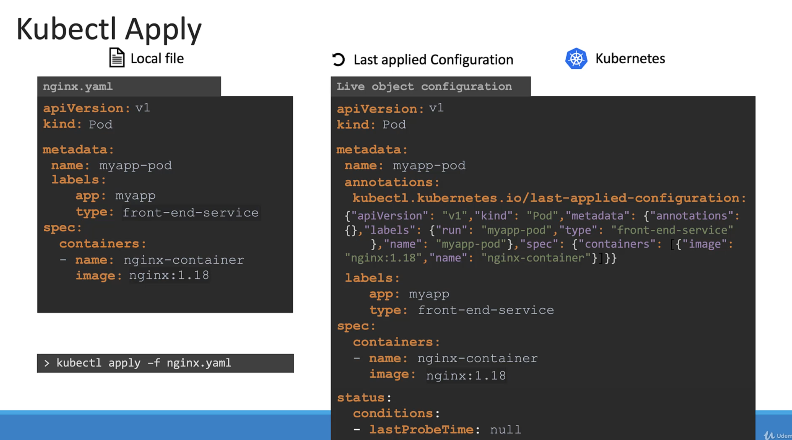
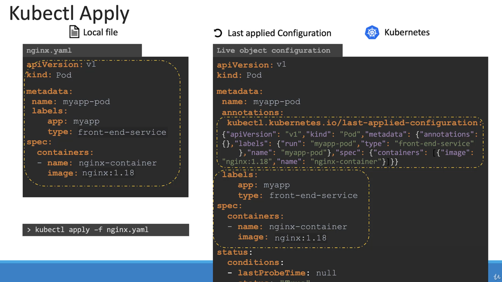

# How kubectl apply command works?

 - When we use the kubectl apply, if the object does not exists, it will create the object.

    

 - When an object is created, it will also create a live object configuration in K8s. This is how K8s internally stores the information about an object.

    

 - When we use kubectl apply it does one more additional thing, the object config is also stored as Last Applied Config in the JSON format

    

 - When any update is performed, all the three are compared to identify what changes are to be made on the live object.

 - Consider when nginx image is updated to 1.19 version in the local file and kubectl apply command is applied. This value is compared with the live object configuration and if there is difference the live configuration is updated with the new value. After any change the last applied config is also updated.

    - 

    - 

    - 

    - 

    - 

# Why do we need last applied config?
	
 - Consider from the local file if the type label was deleted and now when we run the kubectl apply command. It will compare the local file with the last applied config and based on the difference it will update the live object configuration. This means that the field needs to be removed from the live configuration.

  	- 

  	- 

 - So if a field was present in the live configuration and not present in the local or the last applied configuration, then it will be left as is.

 - But if a field is missing from the local field and it is present in the last applied configuration, so that means that in the previous step or whenever the last time we ran the program in that particular field was there and it is now being removed. So the last applied configuration helps us figure out. What field fields have been removed from the local fire? Right, so that field is then removed from the actual live configuration.

# Where is the last applied config json file stored ?
	
 - Well, it's stored on the live object configuration on the cabin in this cluster itself as an annotation named last applied configuration. So remember that this is only done when you use the apply command, the cuttle create or replace command do not stored the last applied configuration like this.
