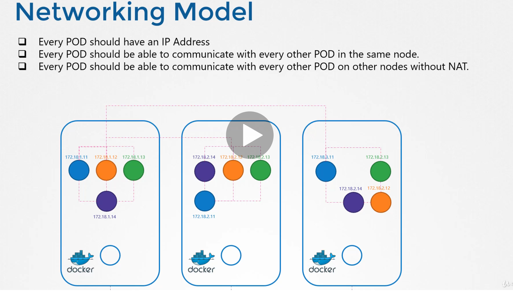

# Pod Networking
```
Best Article: https://sookocheff.com/post/kubernetes/understanding-kubernetes-networking-model/
				  https://www.slideshare.net/SreenivasMakam/deep-dive-into-kubernetes-networking-108505405
				  http://events17.linuxfoundation.org/sites/events/files/slides/Container%20Networking%20Deep%20Dive.pdf
```
  - Take me to [Lecture](https://kodekloud.com/courses/certified-kubernetes-administrator-with-practice-tests/lectures/9808293)

In this section, we will take a look at **Pod Networking**

- Our kubernetes cluster is soon going to have a large number of PODs and services running on it.

- How are these PODs addressed, How do they communicate with each other, how do you access the services running on these PODs internally from within the cluster, as well as externally from outside the cluster.

- These are challenges that kubernetes expects you to solve. As of today, Kubernetes does not come with a built-in solution for this. It expects you to implement a networking solution that solves these challenges. However, Kubernetes have laid out, clearly, the requirements for POD networking. 

- So how do you implement a model that solves these requirements. Now there are many networking solutions available out there that does these. But we have already learned about networking concepts, routing, IP Address management, namespaces and CNI. So let's try to use that knowledge to solve this problem by ourselves first. This will help in understanding how other solutions work.

- To add bridge network on each node

> node01
```
$ ip link add v-net-0 type bridge
```
> node02
```
$ ip link add v-net-0 type bridge
```

> node03
```
$ ip link add v-net-0 type bridge
```

- Currently it's down, turn it up.

> node01
```
$ ip link set dev v-net-0 up
```

> node02
```
$ ip link set dev v-net-0 up
```

> node03
```
$ ip link set dev v-net-0 up
```

- Set the IP Addr for the bridge interface

> node01
```
$ ip addr add 10.244.1.1/24 dev v-net-0
```

> node02
```
$ ip addr add 10.244.2.1/24 dev v-net-0
```

> node03
```
$ ip addr add 10.244.3.1/24 dev v-net-0
```


- Check the reachability 

```
$ ping 10.244.2.2
Connect: Network is unreachable
```

- Add route in the routing table
```
$ ip route add 10.244.2.2 via 192.168.1.12
```

> node01
```
$ ip route add 10.244.2.2 via 192.168.1.12

$ ip route add 10.244.3.2 via 192.168.1.13
```

> node02
```
$ ip route add 10.244.1.2 via 192.168.1.11

$ ip route add 10.244.3.2 via 192.168.1.13

```

> node03
```
$ ip route add 10.244.1.2 via 192.168.1.11

$ ip route add 10.244.2.2 via 192.168.1.12
```

- Add a single large network 


 - Now that works for a small environment and in a simple network. But in larger environments with 100s of nodes in a cluster and 100s of PODs on each node, This is not practical. The routing table may not support so many entries and that is where you need to get creative and look for other solutions.

### Networking Model


## Container Network Interface


- The kubelet on each node is responsible for creating containers. Whenever a container is created, the kubelet looks at the CNI configuration passed as a command line argument when it was run, and identifies our scripts name it then looks in the CNI bin directory to find our script and then executes the script with the add command and the name and namespace ID of the container. And then our scripts takes care of the rest.


```
				Kubelet
				  |
				  |
				  v
			--cni-conf-dir=/etc/cni/net.d
				  |
				  |
				  v
			--cni-bin-dir=/opt/cni/bin
				  |
				  |
				  v
			./net-script.sh  add  <container>  <ns>

```


#### References Docs

- https://kubernetes.io/docs/concepts/workloads/pods/
