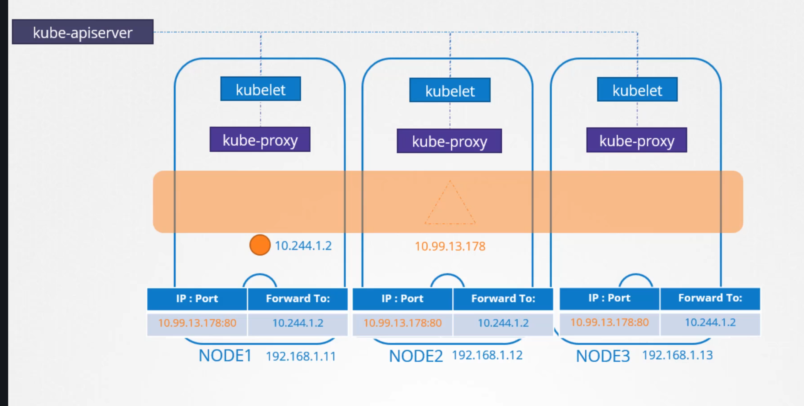
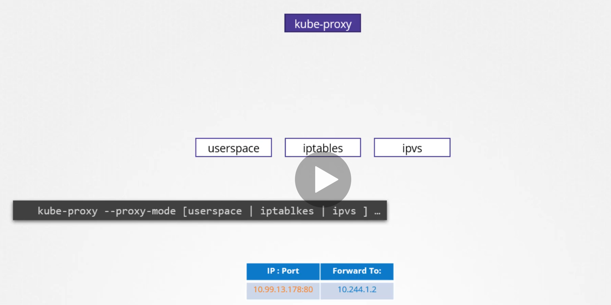
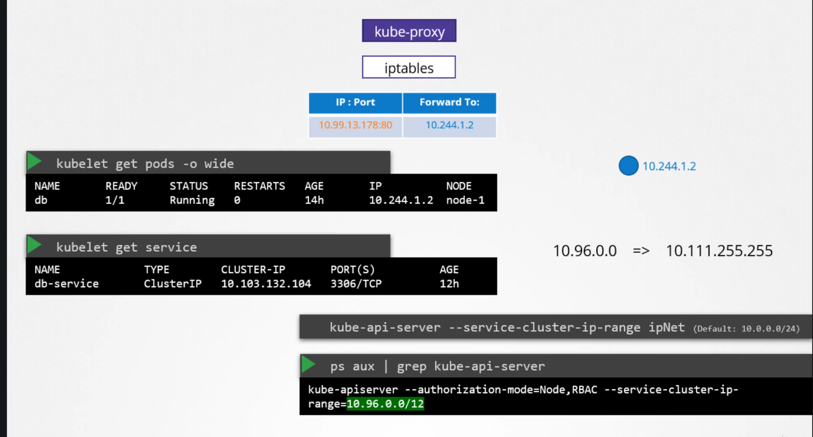
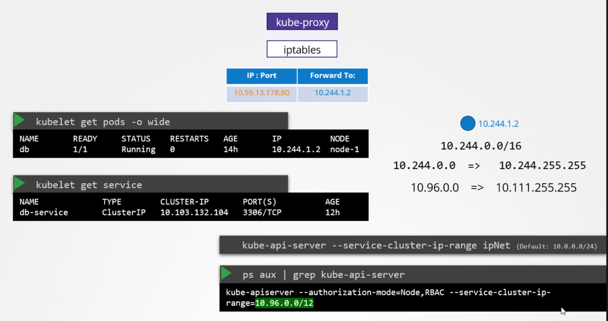
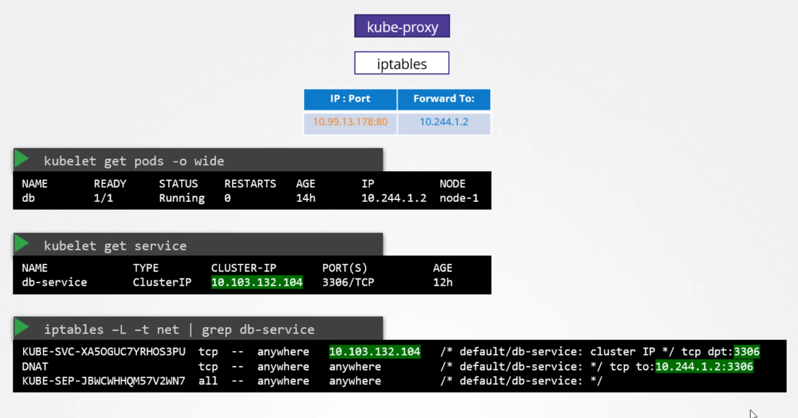
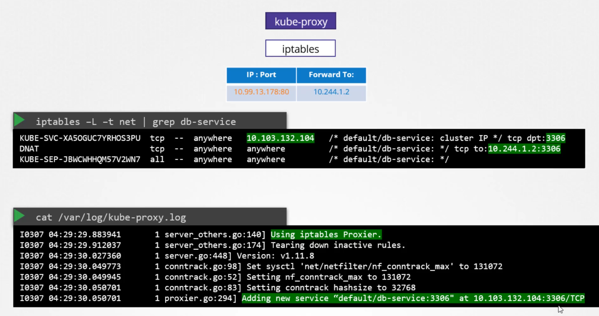

# Service Networking

  - Take me to [Lecture](https://kodekloud.com/courses/certified-kubernetes-administrator-with-practice-tests/lectures/9808291)

In this section, we will take a look at **Service Networking**


## How Services Works
 
   

- We have a three node cluster, no pods or services yet. 

- We know that every kubernetes node runs a kubelet process, which is responsible for creating PODs. Each kubelet service on each node watches the changes in the cluster through the kube-api server, and every time a new POD is to be created, it creates the POD on the nodes. It then invokes the CNI plugin to configure networking for that POD.

- Similarly, each node runs another component known as kube-proxy. Kube proxy watches the changes in the cluster through kube-api server, and every time a new service is to be created, ube-proxy gets into action. Unlike PODs, services are not created on each node or assigned to each node. Services are a cluster wide concept. They exist across all the nodes in the cluster. There are no processes or name spaces or interfaces for a service. It's just a virtual object.

- How do they get an IP address and how were we able to access the application on the pod through service?

	 - When we create a service object in kubernetes, it is assigned an IP address from a pre-defined range.

	 - The kube-proxy components running on each node, get’s that IP address and creates forwarding rules on each node in the cluster, saying any traffic coming to this IP, the IP of the service, should go to the IP of the POD.

   - Once that is in place, whenever a POD tries to reach the IP of the service, it is forwarded to the PODs IP address which is accessible from any node in the cluster.

	 - Now remember it's not just the IP it's an IP and port combination.


- Whenever services are created or deleted the kube-proxy component creates or deletes these rules.

## How are these rules created:

 
 
- kube-proxy supports different ways, such as userspace where kube-proxy listens on a port for each service and proxies connections to the pods. By creating ipvs rules or the third and the default option and the one familiar to us is using IP tables. The proxy mode can be set using the proxy mode option while configuring the kube-proxy service 

- If this is not set, it defaults to iptables

## How iptables are configured by kube-proxy:

  

- We have a pod named db deployed on node-1 and it has IP address 10.244.1.2.

- We create a service of type ClusterIP to make this pod available within the cluster.

- When the service is created kubernetes assigns an IP address to it. It is set to 10.103.132.104 This range is specified in the kube-apiservers option called service-cluster-ip-range. Which is by default set to 10.0.0.0/24.

- Every cluster may have a different service IP Range based on the configuration

  

- During cluster setup we provide two ranges one for POD network and other for service network and this two network should not overlap with each other


 

- You can see the rules created by kube-proxy in the iptables nat table output. Search for the name of the service as all rules created by kube-proxy

- These rules mean, any traffic going to IP address 10.103.132.104 on port 3306 which is the IP of the service, should have its destination address changed to 10.244.1.2 and port 3306 which is the IP of the POD. This is done by adding a DNAT rule to IP tables.


- Similarly, when you create services of type NodePort, kube-proxy creates IPTable rules to forward all traffic coming on a port on all nodes to the respective backend PODs.

 

- You can also see kube-proxy create these entries in the kube-proxy logs itself. In the logs you will find what proxier it uses, in this case its IP tables and the Add an entry when it added a new service for the database.

## Service Types

- ClusterIP 


```
clusterIP.yaml

apiVersion: v1
kind: Service
metadata:
  name: local-cluster
spec:
  ports:
  - port: 80
    targetPort: 80
  selector:
    app: nginx
```

- NodePort

```
nodeportIP.yaml

apiVersion: v1
kind: Service
metadata:
  name: nodeport-wide
spec:
  type: NodePort
  ports:
  - port: 80
    targetPort: 80
  selector:
    app: nginx
```

## To create the service 

```
$ kubectl create -f clusterIP.yaml
service/local-cluster created

$ kubectl create -f nodeportIP.yaml
service/nodeport-wide created
```

## To get the Additional Information

```
$ kubectl get pods -o wide
NAME    READY   STATUS    RESTARTS   AGE   IP           NODE     NOMINATED NODE   READINESS GATES
nginx   1/1     Running   0          1m   10.244.1.3   node01   <none>           <no
```

## To get the Service

```
$ kubectl get service
NAME            TYPE        CLUSTER-IP      EXTERNAL-IP   PORT(S)        AGE
kubernetes      ClusterIP   10.96.0.1       <none>        443/TCP        5m22s
local-cluster   ClusterIP   10.101.67.139   <none>        80/TCP         3m
nodeport-wide   NodePort    10.102.29.204   <none>        80:30016/TCP   2m
```

## To check the Service Cluster IP Range 

```
$ ps -aux | grep kube-apiserver
--secure-port=6443 --service-account-key-file=/etc/kubernetes/pki/sa.pub --
service-cluster-ip-range=10.96.0.0/12

```

## To check the rules created by kube-proxy in the iptables

```
$ iptables -L -t nat | grep local-cluster
KUBE-MARK-MASQ  all  --  10.244.1.3           anywhere             /* default/local-cluster: */
DNAT       tcp  --  anywhere             anywhere             /* default/local-cluster: */ tcp to:10.244.1.3:80
KUBE-MARK-MASQ  tcp  -- !10.244.0.0/16        10.101.67.139        /* default/local-cluster: cluster IP */ tcp dpt:http
KUBE-SVC-SDGXHD6P3SINP7QJ  tcp  --  anywhere             10.101.67.139        /* default/local-cluster: cluster IP */ tcp dpt:http
KUBE-SEP-GEKJR4UBUI5ONAYW  all  --  anywhere             anywhere             /* default/local-cluster: */
```

## To check the logs of kube-proxy

- May this file location is vary depends on your installation process.

```
$ cat /var/log/kube-proxy.log

```


#### References Docs

- https://kubernetes.io/docs/concepts/services-networking/service/
