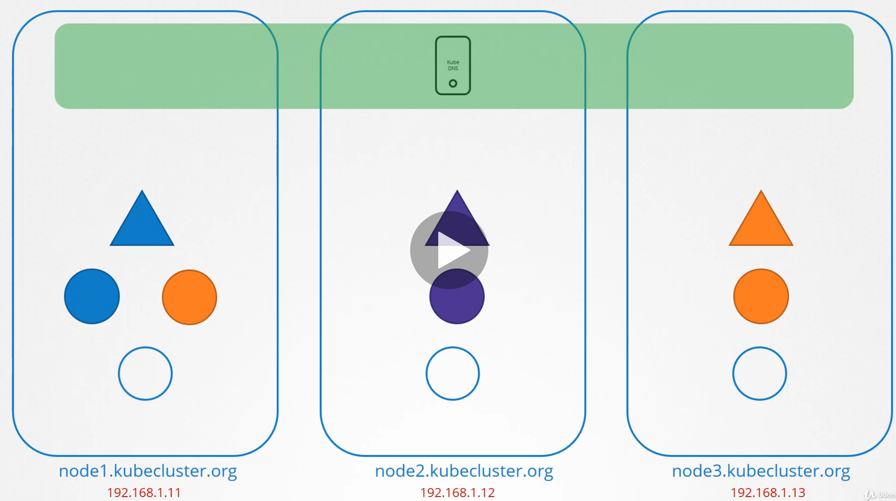
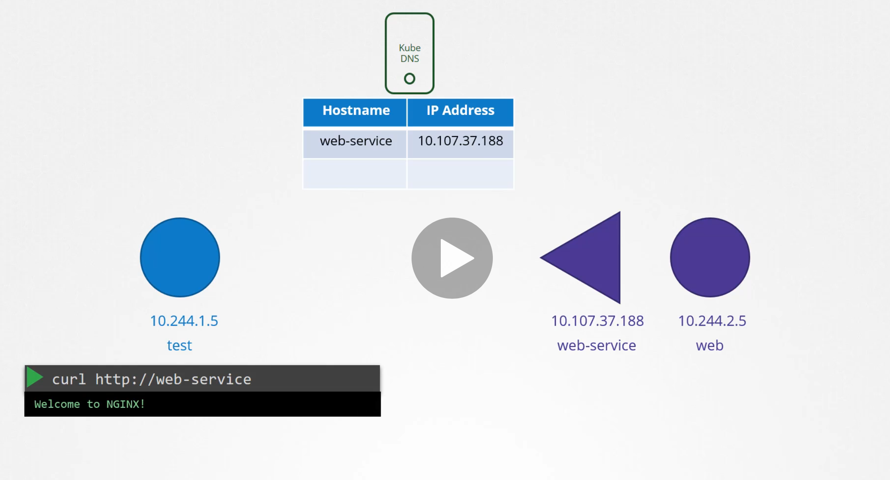
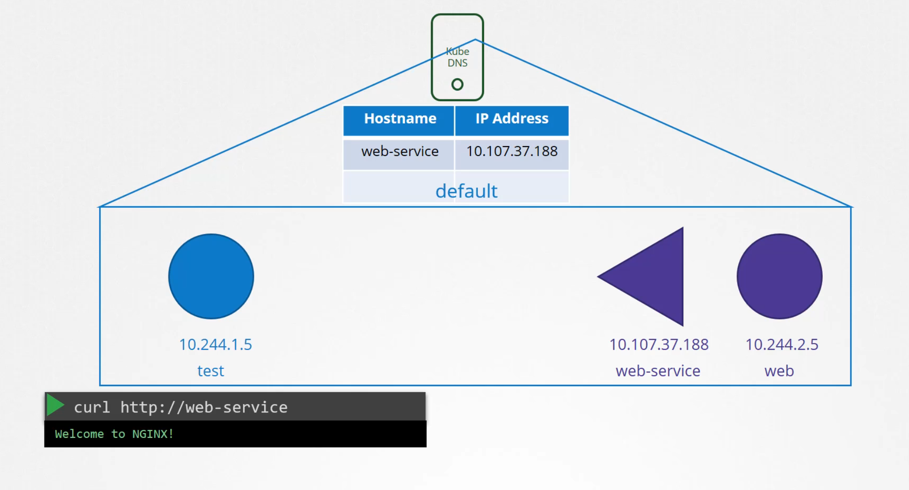
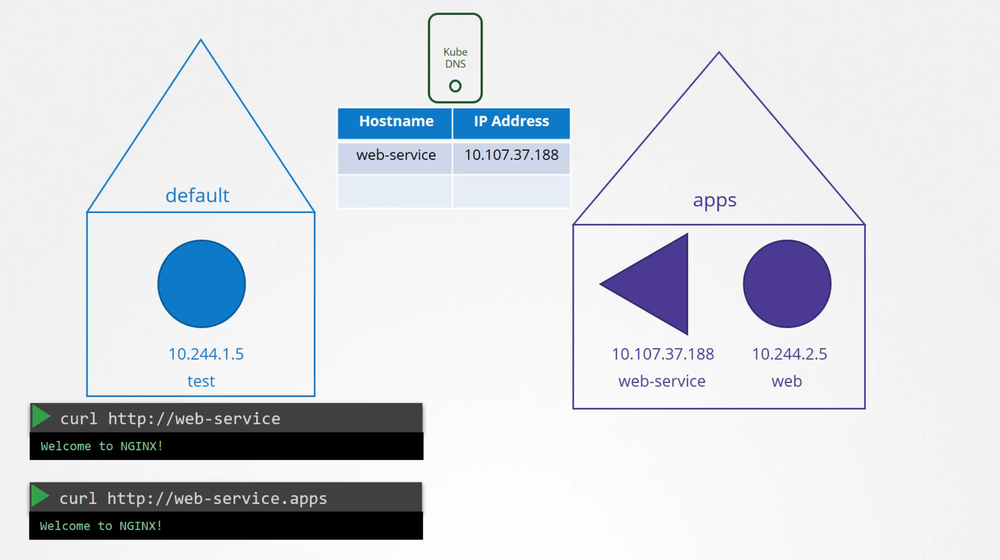
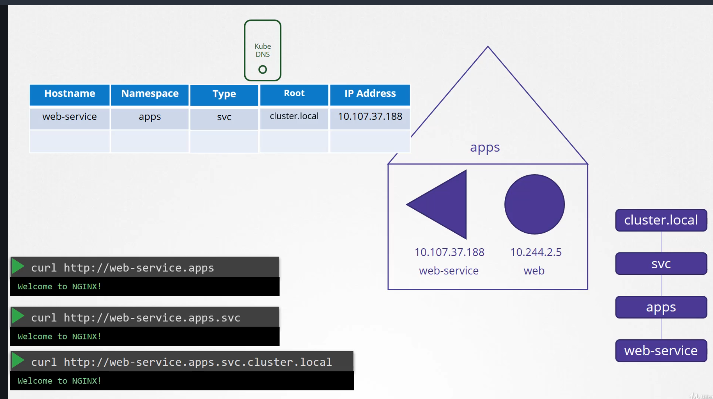
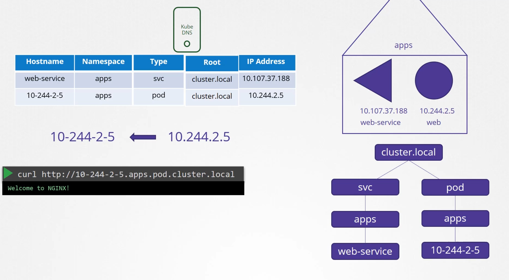
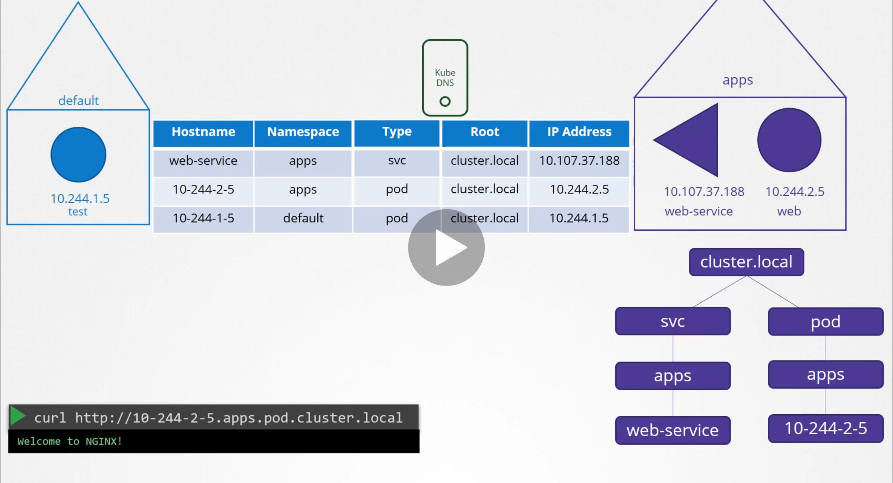

# DNS in Kubernetes

  - Take me to [Lecture](https://kodekloud.com/courses/certified-kubernetes-administrator-with-practice-tests/lectures/9808287)

In this section, we will take a look at **DNS in the Kubernetes Cluster**


## Cluster Setup

  

 - So we have a 3 node kubernetes cluster with some PODs and services deployed on them.

 - Each node has a nodename and IP address assigned to it. The node names and IP addresses of the cluster are probably registered in a DNS server in your organization.

 - Kubernetes deploys a built-in DNS server by default when you setup a cluster.

    

## POD and Service

   
 
 - I have a test pod on the left with the IP set to 10.244.1.5. And I have a web pod on the right, with the IP set to 10.244.2.5. Looking at their IPs, you can guess that they are probably hosted on two different nodes. 

 - We assume that all PODs and services can reach other using their IP addresses.

 - To make the web server accessible to the test pod, we create a service. We name it Web service and The service gets an IP 10.107.37.188

 - Whenever a service is created, the kubernetes DNS service creates a record for the service. It maps the service name to the IP address. So within the cluster any pod can now reach the service using its service name.


## POD and Service Communication in same NS

  

- In this case since the test pod and the web pod and its associated service are all in the same namespace. The default namespace. You were able to simply reach the web-service from the test pod using just the service name web service.


## POD and Service Communication in different NS

  

 - Let's assume the web service was in a separate namespace named apps.

 - Then to refer to it from the default namespace. you would have to say web-service.apps. The last name of the service is now the name of the namespace.


## K8S DNS Table

  

 -  For each namespace the DNS server creates a subdomain with the name of namespace 
 -  All the services under different NS are grouped together into another subdomain called SVC.

 - So you can reach your application with the name web-service.apps.svc.

 - Finally, all the services and PODs under different NS are grouped together into a root domain for the cluster, which is set to cluster.local by default. 

 - So you can access the service using the URL web-service.apps.svc.cluster.local. That’s the fully qualified domain name for the service. 


## Records for PODs are not created by default. But we can enable that explicitly:

  

 - Once enabled, Records are created for pods as well.

 - It does not use the POD name though. For each POD kubernetes generates a name by replacing the dots in the IP address with dashes.

 - The namespace remains the same and type is set to pod. The root domain is always cluster.local.

  


## Pod DNS Record

- The following DNS resolution:

```
<POD-IP-ADDRESS>.<namespace-name>.pod.cluster.local
```
> Example
```
# Pod is located in a default namespace

10-244-1-10.default.pod.cluster.local
```

```
# To create a namespace
$ kubectl create ns apps

# To create a Pod
$ kubectl run nginx --image=nginx --namespace apps

# To get the additional information of the Pod in the namespace "apps"
$ kubectl get po -n apps -owide
NAME    READY   STATUS    RESTARTS   AGE   IP           NODE     NOMINATED NODE   READINESS GATES
nginx   1/1     Running   0          99s   10.244.1.3   node01   <none>           <none>

# To get the dns record of the nginx Pod from the default namespace
$ kubectl run -it test --image=busybox:1.28 --rm --restart=Never -- nslookup 10-244-1-3.apps.pod.cluster.local
Server:    10.96.0.10
Address 1: 10.96.0.10 kube-dns.kube-system.svc.cluster.local

Name:      10-244-1-3.apps.pod.cluster.local
Address 1: 10.244.1.3
pod "test" deleted

# Accessing with curl command
$ kubectl run -it nginx-test --image=nginx --rm --restart=Never -- curl -Is http://10-244-1-3.apps.pod.cluster.local
HTTP/1.1 200 OK
Server: nginx/1.19.2

```

## Service DNS Record

- The following DNS resolution:

```
<service-name>.<namespace-name>.svc.cluster.local
```
> Example
```
# Service is located in a default namespace

web-service.default.svc.cluster.local
```
- Pod, Service is located in the `apps` namespace

```
# Expose the nginx Pod
$ kubectl expose pod nginx --name=nginx-service --port 80 --namespace apps
service/nginx-service exposed

# Get the nginx-service in the namespace "apps"
$ kubectl get svc -n apps
NAME            TYPE        CLUSTER-IP      EXTERNAL-IP   PORT(S)   AGE
nginx-service   ClusterIP   10.96.120.174   <none>        80/TCP    6s

# To get the dns record of the nginx-service from the default namespace
$ kubectl run -it test --image=busybox:1.28 --rm --restart=Never -- nslookup nginx-service.apps.svc.cluster.local
Server:    10.96.0.10
Address 1: 10.96.0.10 kube-dns.kube-system.svc.cluster.local

Name:      nginx-service.apps.svc.cluster.local
Address 1: 10.96.120.174 nginx-service.apps.svc.cluster.local
pod "test" deleted

# Accessing with curl command
$ kubectl run -it nginx-test --image=nginx --rm --restart=Never -- curl -Is http://nginx-service.apps.svc.cluster.local
HTTP/1.1 200 OK
Server: nginx/1.19.2

```


#### References Docs

- https://kubernetes.io/docs/concepts/services-networking/dns-pod-service/
- https://kubernetes.io/docs/tasks/administer-cluster/dns-debugging-resolution/
