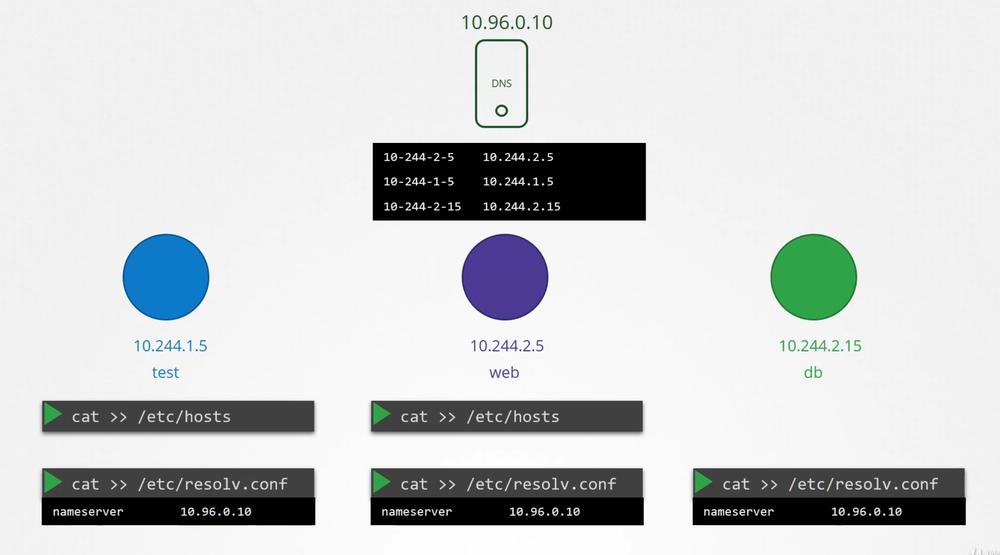
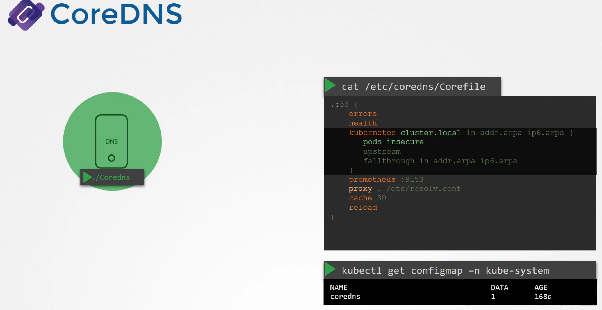
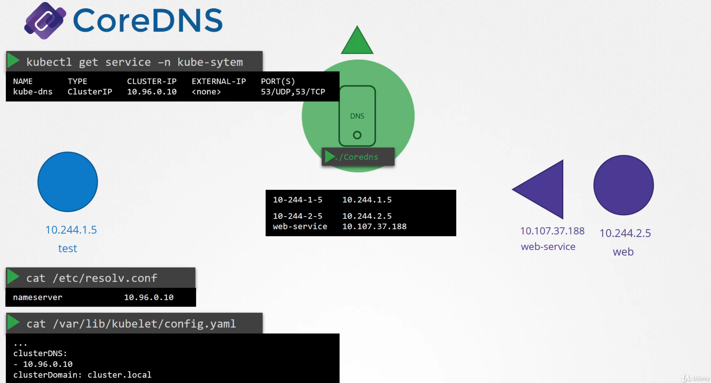
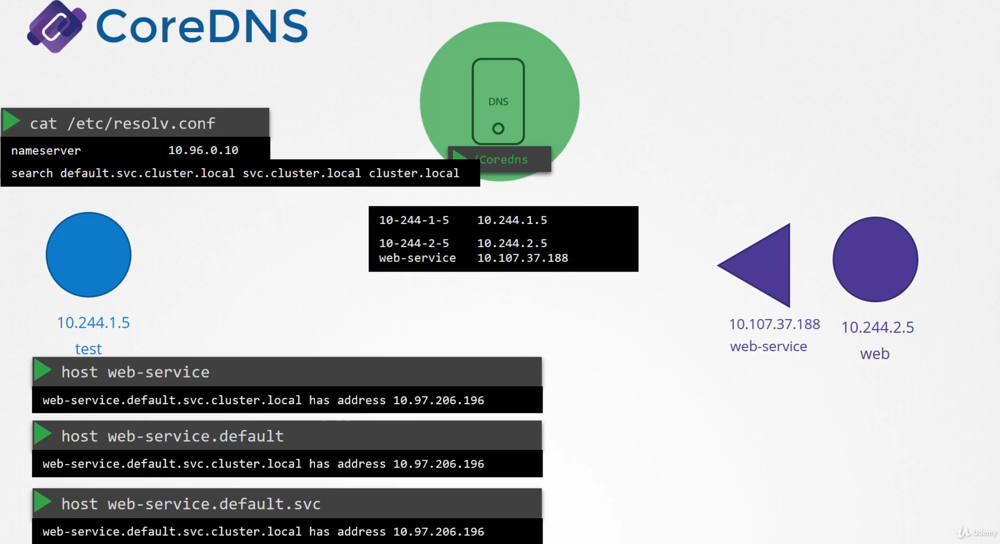
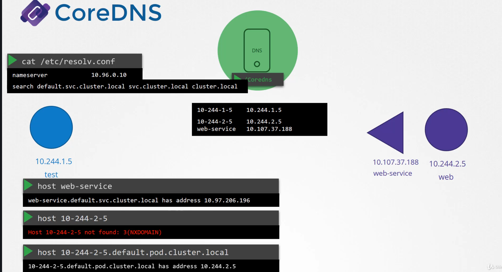

# CoreDNS in Kubernetes

  - Take me to [Lecture](https://kodekloud.com/courses/certified-kubernetes-administrator-with-practice-tests/lectures/9808285)

In this section, we will take a look at **CoreDNS in the Kubernetes**


## POD DNS Entry:
	
	 


## CoreDNS
 
 - K8S deploys a DNS server within the cluster. With Kubernetes version 1.12 the recommended DNS server is CoreDNS. 

 - The CoreDNS server is deployed as a POD in the kube-system namespace in the kubernetes cluster. Well they are deployed as two pods for redundancy, as part of a replicaset, they are actually a replicaset within a deployment

  

 - This POD runs the coreDNS executable, the same executable

 - CoreDNS requires a configuration file. It uses a file named Corefile located at /etc/coredns. Within this file you have a number of plugins configured.

 - The pods option you see here, is what is responsible for creating a record for PODs in the cluster.

 - Any record that this Core DNS server can’t solve, for example say a POD tries to reach www.google.com it is forwarded to the nameserver specified in the coredns pods /etc/resolv.conf file. The /etc/resolv.conf file is set to use the nameserver from the kubernetes 

 - This core file is passed into the pod has a configMap object. That way if you need to modify this configuration you can edit the ConfigMap object. 


## DNS Server Address in POD:
	


 - We now have the coredns pod up and running using the appropriate kubernetes plugin. It watches the kubernetes cluster for new PODs or services, and every time a pod or a service is created it adds a record for it in its database.

 - What address do the PODs use to reach the DNS server? When we deploy CoreDNS solution, It also creates a service to make it available to other components within a cluster. The service is named as kube-dns by default. The IP address of this service is configured as nameserver on the PODs. The DNS configurations on PODs are done by kubernetes automatically when the PODs are created. 

 - Want to guess which kubernetes component is responsible for that? The kubelet.

   - If you look at the config file of the kubelet you will see the IP of the DNS server and domain in it. Once the pods are configured with the right nameserver, you can now resolve other pods and services.


   - You can access the web-service using just web-service, or web-service.default or web-service.default.svc or web service.default.svc.cluster.local. 

   
   
   - If you try to manually lookup the web-service using nslookup or the host command web-service command, it will return the fully qualified domain name of the web-service, which happens to be web-service.default.svc.cluster.local. The resolv.conf file also has a search entry which is set to default.svc.cluster.local  as well as svc.cluster.local and cluster.local. This allows you to find the service using any name. web-service or web-service.default or web-service.default.svc. 

   
   
   - However, notice that it only has search entries for service . So you won’t be able to reach a pod the same way.


## To view the Pod

```
$ kubectl get pods -n kube-system
NAME                                      READY   STATUS    RESTARTS   AGE
coredns-66bff467f8-2vghh                  1/1     Running   0          53m
coredns-66bff467f8-t5nzm                  1/1     Running   0          53m
```

## To view the Deployment

```
$ kubectl get deployment -n kube-system
NAME                      READY   UP-TO-DATE   AVAILABLE   AGE
coredns                   2/2     2            2           53m
```

## To view the configmap of CoreDNS

```
$ kubectl get configmap -n kube-system
NAME                                 DATA   AGE
coredns                              1      52m
```

## CoreDNS Configuration File

```
$ kubectl describe cm coredns -n kube-system

Corefile:
---
.:53 {
    errors
    health {       lameduck 5s
    }
    ready
    kubernetes cluster.local in-addr.arpa ip6.arpa {
       pods insecure
       fallthrough in-addr.arpa ip6.arpa
       ttl 30
    }
    prometheus :9153
    forward . /etc/resolv.conf
    cache 30
    loop
    reload
}
```

## To view the Service 

```
$ kubectl get service -n kube-system
NAME       TYPE        CLUSTER-IP   EXTERNAL-IP   PORT(S)                  AGE
kube-dns   ClusterIP   10.96.0.10   <none>        53/UDP,53/TCP,9153/TCP   62m
```

## To view Configuration into the kubelet 

```
$ cat /var/lib/kubelet/config.yaml | grep -A2  clusterDNS
clusterDNS:
- 10.96.0.10
clusterDomain: cluster.local

```

## To view the fully qualified domain name

- With the `host` command, we will get fully qualified domain name (FQDN).

```
$ host web-service
web-service.default.svc.cluster.local has address 10.106.112.101

$ host web-service.default
web-service.default.svc.cluster.local has address 10.106.112.101

$ host web-service.default.svc
web-service.default.svc.cluster.local has address 10.106.112.101

$ host web-service.default.svc.cluster.local
web-service.default.svc.cluster.local has address 10.106.112.101
```

## To view the `/etc/resolv.conf` file

```
$ kubectl run -it --rm --restart=Never test-pod --image=busybox -- cat /etc/resolv.conf
nameserver 10.96.0.10
search default.svc.cluster.local svc.cluster.local cluster.local
options ndots:5
pod "test-pod" deleted
```

## Resolve the Pod 

```
$ kubectl get pods -o wide
NAME      READY   STATUS    RESTARTS   AGE     IP           NODE     NOMINATED NODE   READINESS GATES
test-pod   1/1     Running   0          11m     10.244.1.3   node01   <none>           <none>
nginx      1/1     Running   0          10m     10.244.1.4   node01   <none>           <none>

$ kubectl exec -it test-pod -- nslookup 10-244-1-4.default.pod.cluster.local
Server:    10.96.0.10
Address 1: 10.96.0.10 kube-dns.kube-system.svc.cluster.local

Name:      10-244-1-4.default.pod.cluster.local
Address 1: 10.244.1.4 
```

## Resolve the Service

```
$ kubectl get service
NAME          TYPE        CLUSTER-IP       EXTERNAL-IP   PORT(S)   AGE
kubernetes    ClusterIP   10.96.0.1        <none>        443/TCP   85m
web-service   ClusterIP   10.106.112.101   <none>        80/TCP    9m

$ kubectl exec -it test-pod -- nslookup web-service.default.svc.cluster.local
Server:    10.96.0.10
Address 1: 10.96.0.10 kube-dns.kube-system.svc.cluster.local

Name:      web-service.default.svc.cluster.local
Address 1: 10.106.112.101 web-service.default.svc.cluster.local

```


#### References Docs

- https://kubernetes.io/docs/concepts/services-networking/dns-pod-service/#services
- https://kubernetes.io/docs/concepts/services-networking/dns-pod-service/#pods
