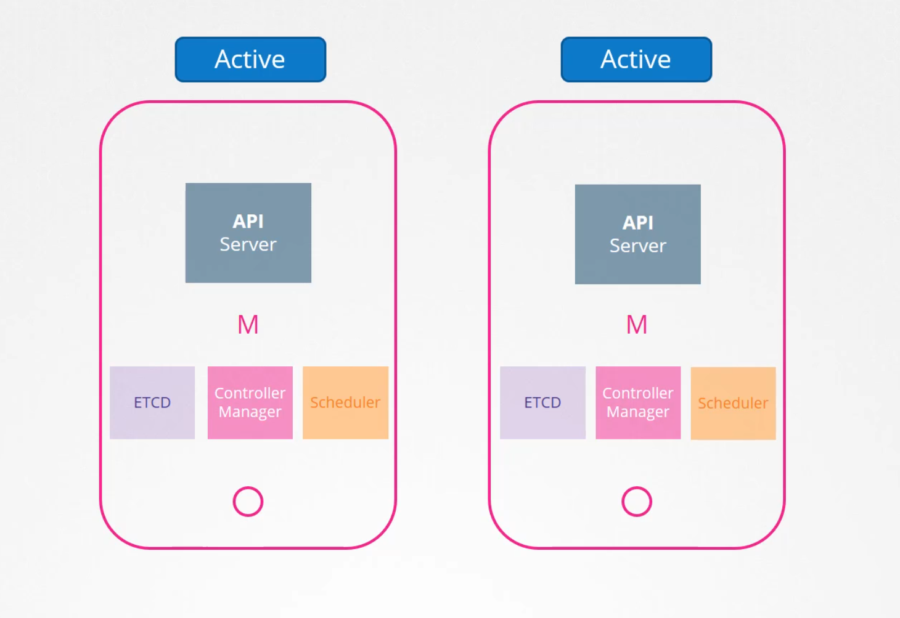
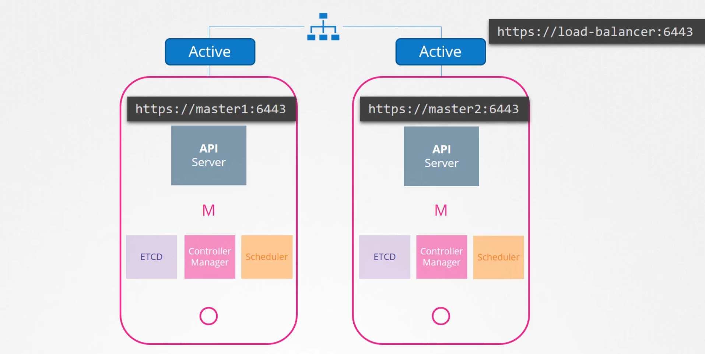
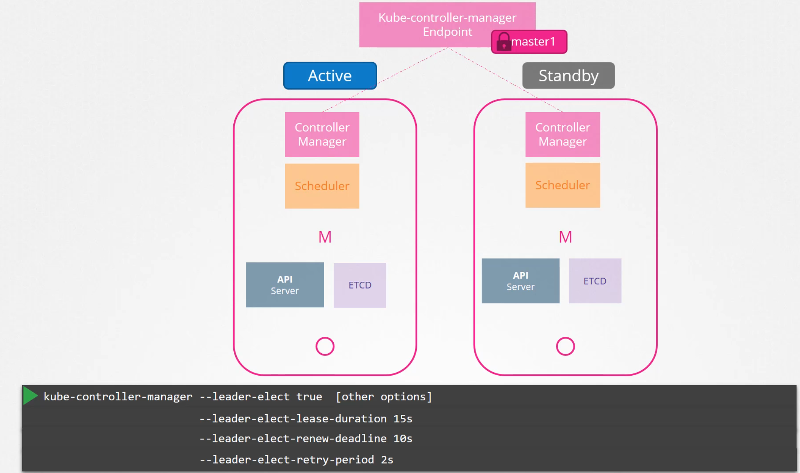
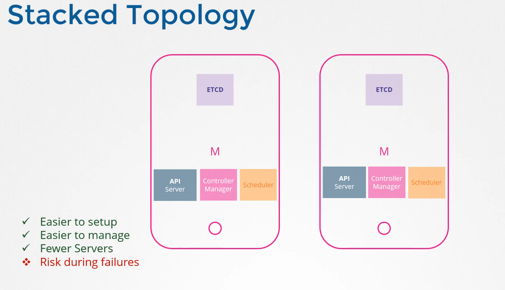
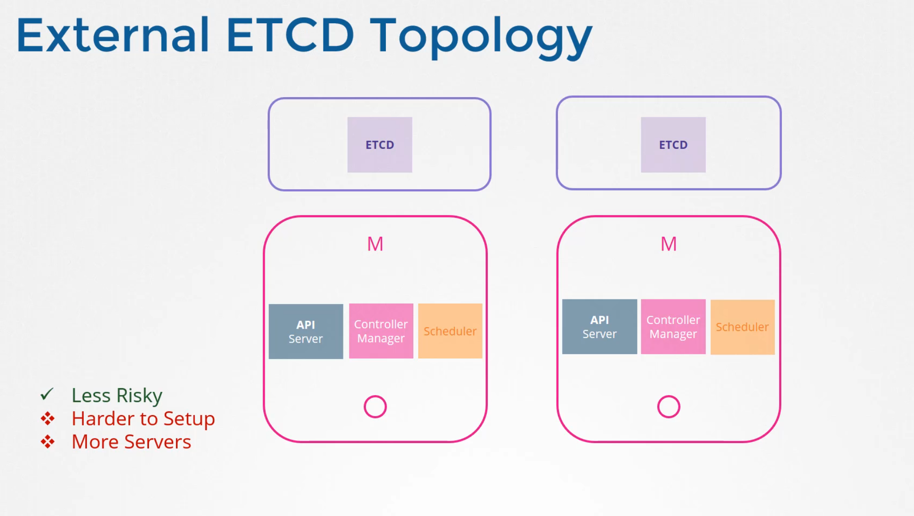
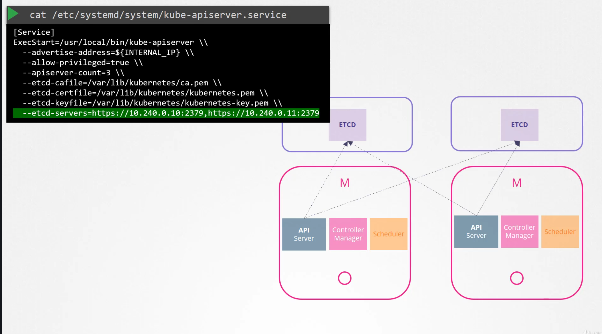
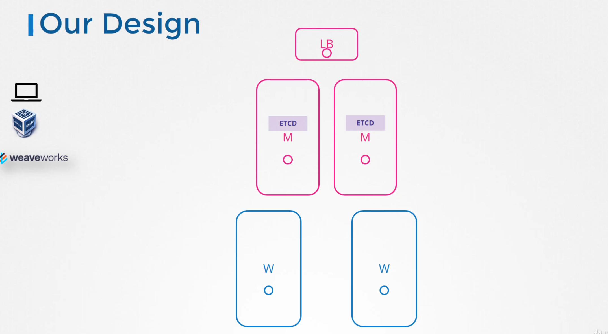

# Choosing a HA

  Take me to [Lecture](https://kodekloud.com/courses/539883/lectures/9808328)

- Multiple master Node in the cluster for HA so that even if one of the master goes down other master can be used to manage the cluster and workloads

- In HA setup, same control plane components are running on multiple master nodes

- How does the control plane components works when same components are running in multiple nodes?

- It depends on what the component do.
   
   
- For API Server:
  - API Server on all the master nodes can be alive and serve requests at the same time in Active Active Mode
  - We can directly send the request to either of the master node or we can place an LB in front of the API Server/ Master Node
   
   
   
   
   
- For Controller-Manager:
  - If multiple instances of those run in parallel, then they might duplicate actions resulting in more objects/PODS than actually needed.
  - They must not run in parallel
  - They must run in Active Standy Mode

- who decides which among the two is active and which is passive?
 - This is decided by the leader election process.
 - In controller manager config, you may specify the leader elect option which is by default set to true.
 - With this option when the controller manager process starts it tries to gain a lease or a lock on an endpoint object in kubernetes named as kube-controller-manager endpoint. Which ever process first updates the endpoint with this information gains the lease and becomes the active of the two and the other becomes passive 

 - It holds the lock for the lease duration specified using the leader-elect-lease-duration option which is by default set to 15 seconds.

- The active process then renews the lease every 10 seconds which is the default value for the option leader-elect-renew-deadline. 

- Both the processes tries to become the leader every two seconds, set by the leader-elect-retry-period option. 

- That way if one process fails maybe because the first must of crashes then the second process can acquire the lock and become the leader.

- For Schedular:
  Same as controller-manager

   
   
- For ETCD:
  - 2 topology, one with ETCD on the master Node and second one is ETCD seperated out of master node   
  
   
   
   
   
   
   
   

   
