# ETCD in HA

  Take me to [Lecture](https://kodekloud.com/courses/539883/lectures/9808331)
  

- ETCD is a distributed, reliable, simple, secure and fast key value store

### How ETCD is a distributed
- We have 3 servers, all running etcd, and all maintaining an identical copy of the database. So if you lose one you still have two copies of your data.
 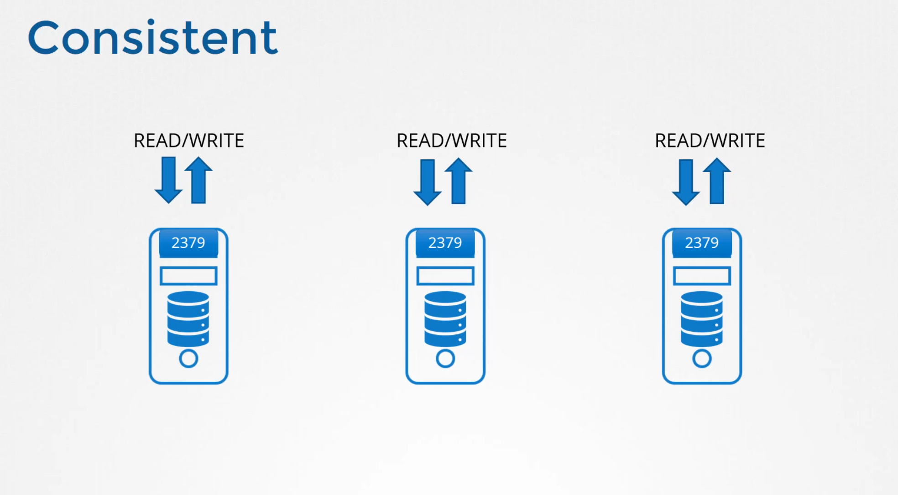

### How does it ensure the data on all the nodes are consistent.
- You can write to any instance and read your data from any instance.

- With reads, its easy. Since the same data is available across all nodes, you can easily read it from any nodes. 
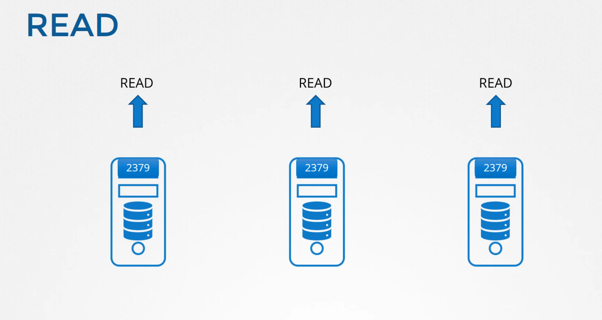

- But that is not the case with writes, What if two write requests come in on two different instances?
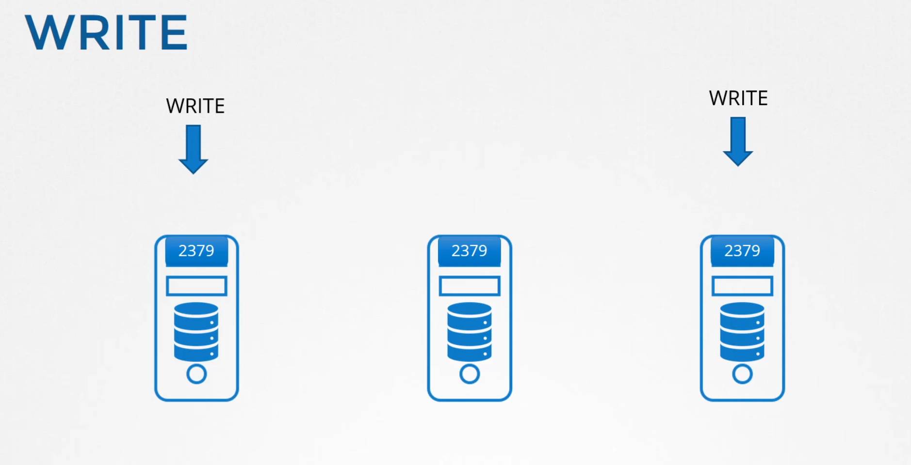

- Actually ETCD does not process the writes on each node.
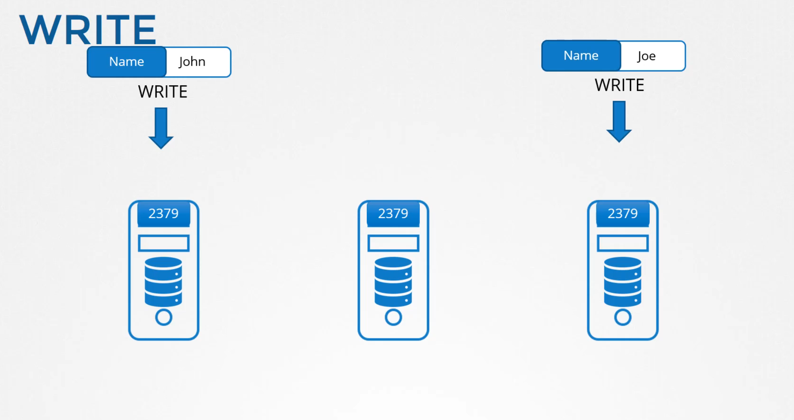

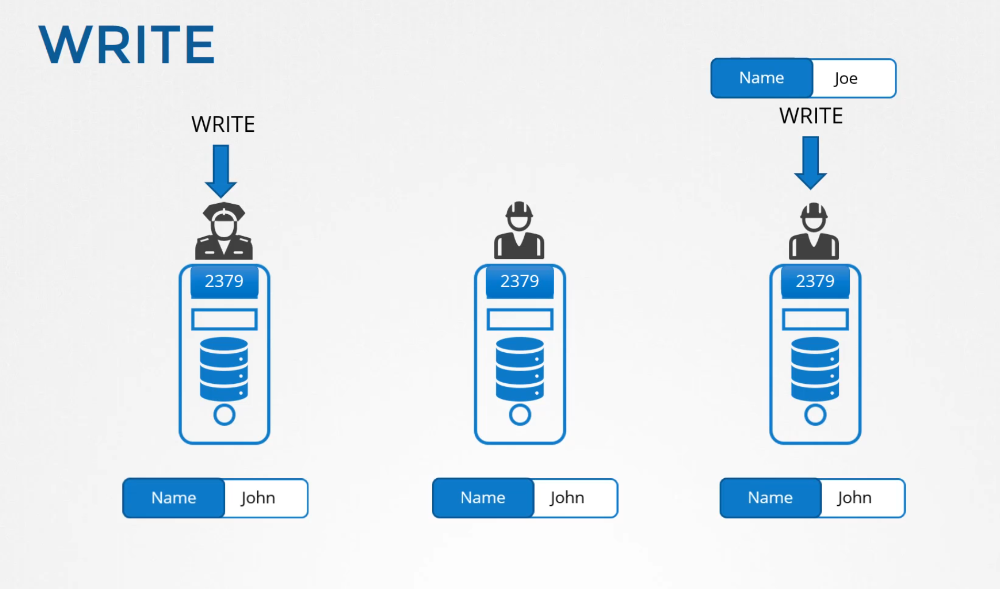

- Instead, only one of the instances is responsible for processing the writes. Internally the two nodes elect a leader among them. Of the total instances one node becomes the leader and the other node becomes the followers.

- If the writes came in through the leader node, then the leader processes the write. The leader makes sure that the other nodes are sent a copy of the data.

- If the writes come in through any of the other follower nodes, then they forward the writes to the leader internally and then the leader processes the writes. Again when the writes are processed, the leader ensures that copies of the write are distributed to other instances in the cluster.

- Thus a write is only considered complete, if the leader gets consent from other members in the cluster.

### How Leader election happens.

- ETCD implements distributed consensus using RAFT protocol. 
- Let's see how that works in a three node cluster. When the cluster is setup we have 3 nodes that do not have a leader elected. 
- RAFT algorithm uses random timers for initiating requests. For example a random timer is kicked off on the three managers the first one to finish the timer sends out a request to the other node requesting permission to be the leader. The other managers on receiving the request responds with their vote and the node assumes the Leader role. 

- In case the other nodes do not receive a notification from the leader at some point in time which could either be due to the leader going down or losing network connectivity the nodes initiate a re-election process among themselves and a new leader is identified

##  How do they ensure a write is propogated across all instances?
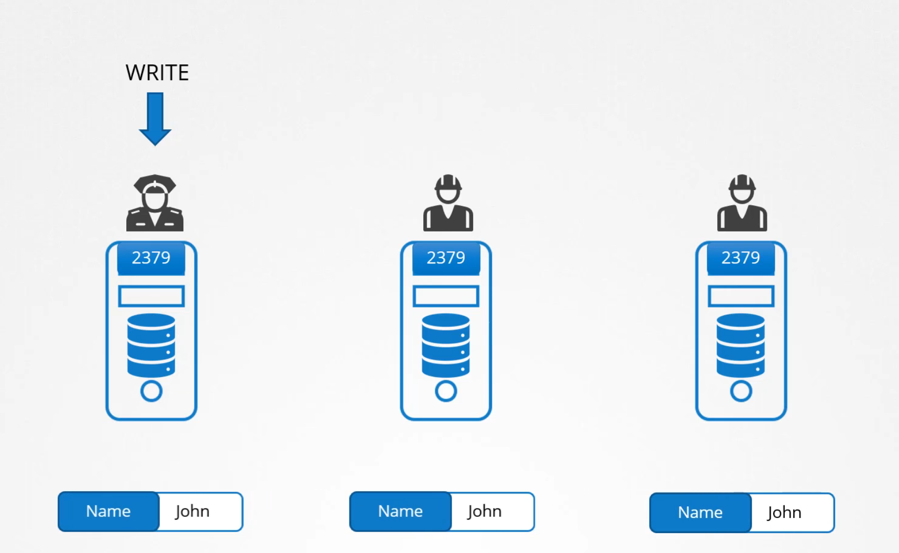

- When a write is processed by the leader and is replicated to other nodes in the cluster, the right is considered to be complete only once it is replicated to the other instances in the cluster

- Say for example a new write comes in but one of the node is not responding. And hence the leader is only able to write to 2 nodes in the cluster. 
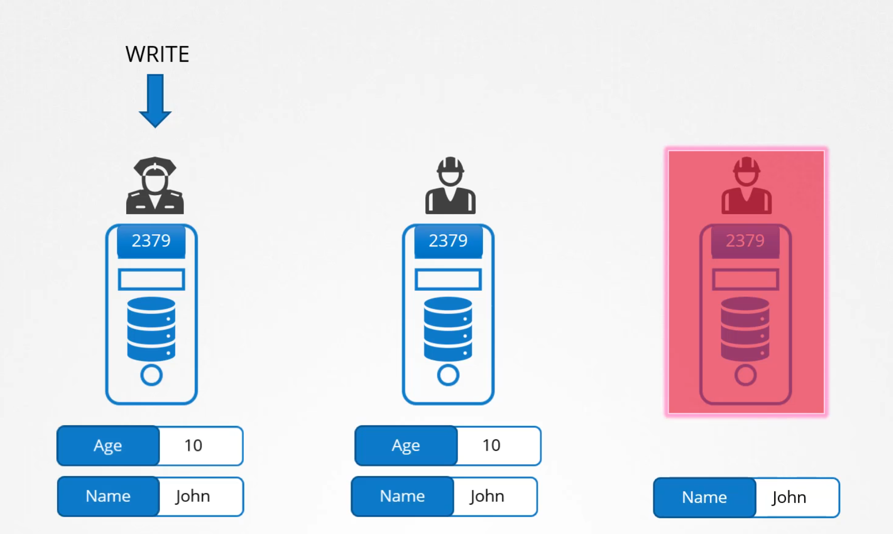

- Is the write considered to be complete? Does it wait for the third node to be up? Or does it fail? A write is considered to be complete, if it can be written on the majority of the nodes in the cluster. For example, in this case of the 3 nodes, the majority is 2.

- ETCD uses Quorum for majority
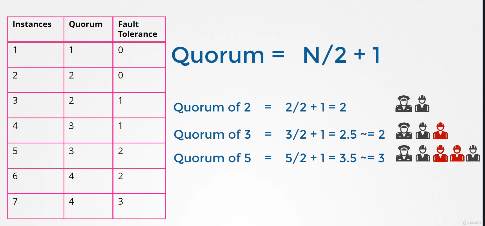

- Old number of Nodes are preferred over even numbers
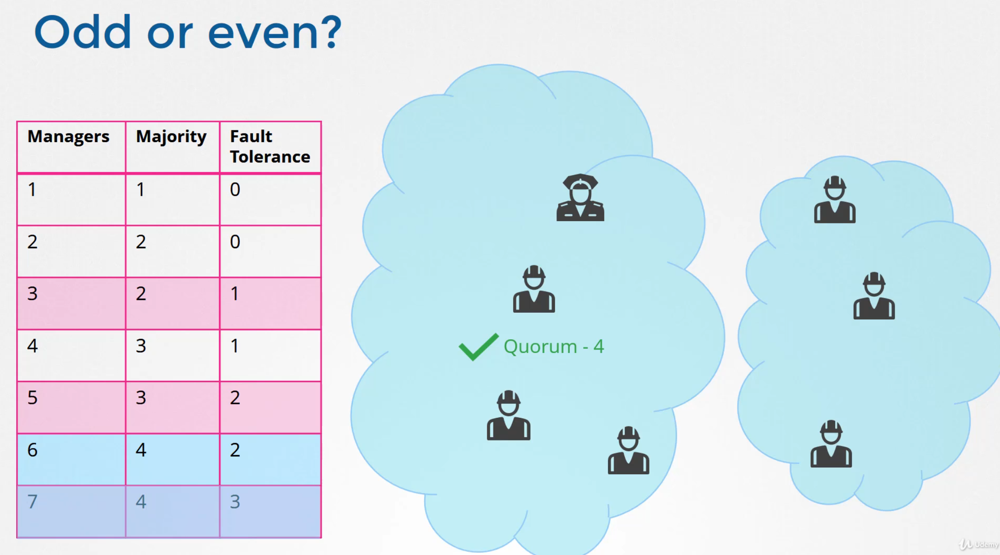

## Install ETCD

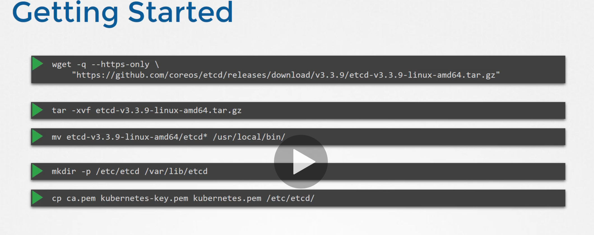
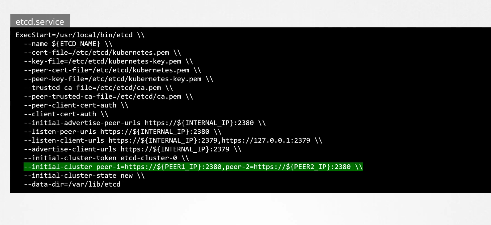
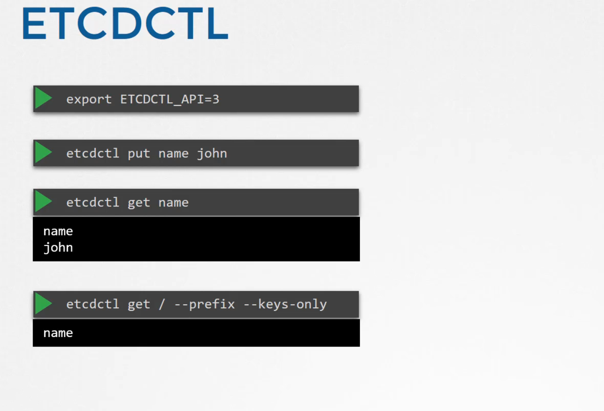
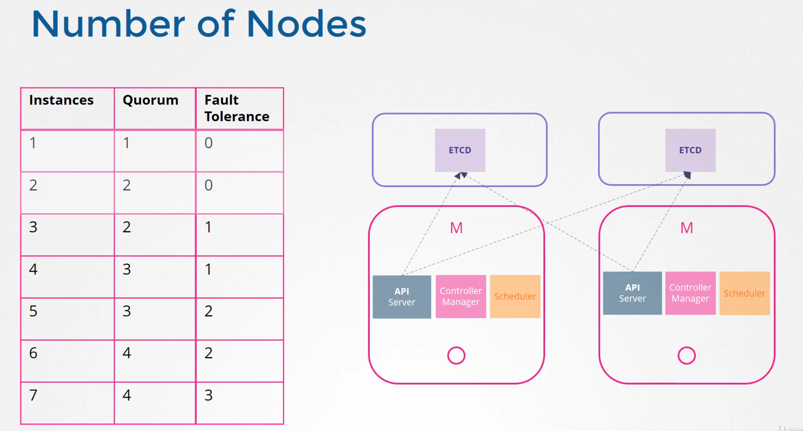

  
 
